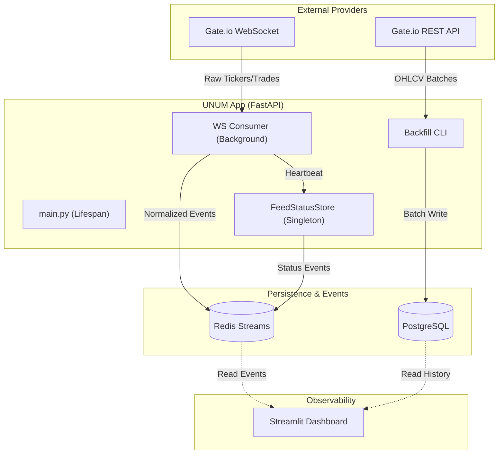
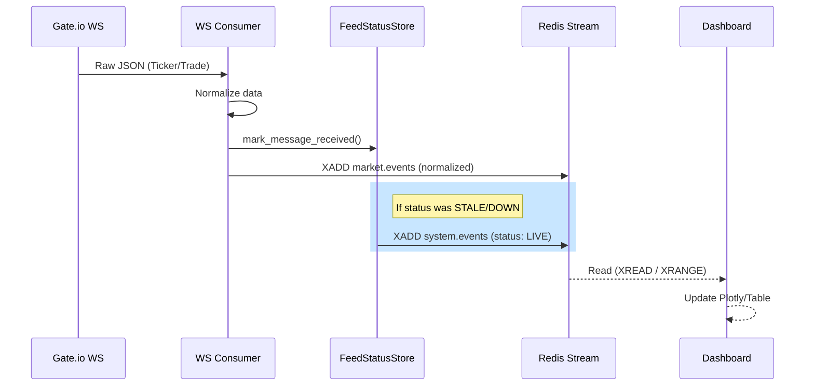
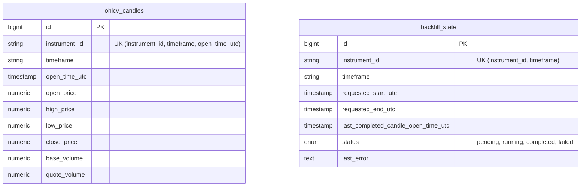

# UNUM Trading Bot — Developer Handoff (Sprint 2)

Этот документ предназначен для разработчиков, принимающих проект после завершения Sprint 2. Он фокусируется на внутреннем устройстве системы, архитектурных решениях и путях расширения функционала.

---

## 1. Философия и Технологический стек

Система спроектирована как **асинхронный конвейер обработки данных** с минимальной задержкой. 

- **FastAPI**: Выбран для асинхронного API и управления жизненным циклом фоновых задач.
- **Redis Streams**: Используется как «шина событий» (Event Bus) для нормализованных данных. Это позволяет разделять (decouple) приём данных от их обработки (сигналы, дашборд, исполнение).
- **PostgreSQL**: Хранилище «золотого стандарта» (Source of Truth) для исторических свечей и состояний.
- **uv**: Современный менеджер пакетов для быстрой и воспроизводимой сборки окружения.

---

## 2. Архитектура Системы

Ниже представлена общая схема взаимодействия компонентов.



---

## 3. Потоки данных (Data Flows)

### 3.1 Live Market Data
Движение данных от биржи до отображения:



---

## 4. Глубокое погружение в компоненты

### 4.1 FeedStatusStore (Thread-safe Singleton)
`app/core/feed_status.py`

Это сердце системы мониторинга. Хранилище в памяти (не персистентное), которое отслеживает «живость» входящего потока данных.
- **Механизм**: Фоновая задача `_run_stale_checker` каждые 10 секунд проверяет время последнего сообщения.
- **Статусы**: 
    - `LIVE`: Обычный режим.
    - `STALE`: Данные не поступали более 60 сек (настраивается). `entries_blocked` ставится в `True`.
    - `DOWN`: Соединение разорвано.

### 4.2 WebSocket Consumer
`app/modules/ingestion/ws_consumer.py`

Оркестрирует асинхронный цикл. 
- **Идемпотентность**: Каждое сообщение из WebSocket получает метку `ingested_at_utc`.
- **Отказоустойчивость**: Использует экспоненциальный бэкoфф (на стороне `gateio_ws.py`) при обрывах связи.

### 4.3 Backfill Engine
`app/modules/ingestion/backfill.py`

CLI-инструмент для синхронизации истории.
- **Алгоритм**:
    1. Проверяет `backfill_state` в БД.
    2. Определяет `cursor` (откуда продолжать).
    3. Загружает батч из REST API биржи.
    4. Выполняет `UPSERT` (через `ON CONFLICT DO NOTHING`) в таблицу `ohlcv_candles`.
    5. Обновляет состояние в `backfill_state`.

---

## 5. Схема базы данных



---

## 6. Расширение системы (Extensibility)

### Как добавить новую биржу (например, ByBit)?
1. **Ingestion**: Релизовать `ByBitWebSocketClient` и `ByBitRESTClient` (наследуясь или следуя интерфейсу GateIo).
2. **Normalization**: Добавить логику приведения данных ByBit к единому формату в `WSC`.
3. **Configuration**: Добавить `BYBIT_WS_URL` в `Settings`.
4. **Consumer**: Запустить второй инстанс `WSC` в `main.py` или сделать фабрику потребителей.

### Как добавить новый инструмент?
1. В `.env` или через переменные окружения изменить `WS_CURRENCY_PAIR`.
2. Система автоматически создаст записи в БД и Redis Stream с новым `instrument_id`.

---

## 7. Советы по локальной разработке и отладке (Dev Tips)

### Мониторинг WebSocket через консоль
Если нужно посмотреть «сырой» поток данных без записи в Redis:
```bash
uv run python -m app.modules.ingestion.gateio_ws
# (Скрипт выведет поток JSON-сообщений в stdout)
```

### Загрузка истории вручную
Если нужно докачать данные за конкретный период без ожидания автоматики:
```bash
uv run python -m app.modules.ingestion.backfill --start-utc 2026-01-01T00:00:00Z --end-utc 2026-01-02T00:00:00Z
```

### Сброс стейта Redis
Стримы могут расти. Для полной очистки в процессе разработки:
```bash
redis-cli DEL market.events system.events signal.events
```

### Дебаг-логирование
Установите `LOG_LEVEL=DEBUG` для просмотра каждого входящего тикера:
```bash
export LOG_LEVEL=DEBUG
uv run uvicorn app.main:app
```

---

## 8. Известный технический долг (Technical Debt)

> [!WARNING]
> **Имена переменных**: В `app.api.ready` функция `is_database_connected()` сейчас всегда возвращает `True`. Нужно реализовать реальный `ping` к Postgres.

> [!CAUTION]
> **Синлгтон-ловушка**: В `app/core/config.py` случайно инициализируется второй объект `feed_status_store`. Пока это не мешает (все импортируют первый из `feed_status.py`), но этот "мёртвый" код нужно удалить при рефакторинге.

---

## 9. План на будущее (Next Steps)

1. **Gating per-instrument**: Текущая блокировка `entries_blocked` — глобальная. Нужно сделать её специфичной для каждой пары.
2. **Alert Ingestion**: Реализовать эндпоинт `POST /alerts/tradingview` и писать его в `signal.events`.
3. **Health API**: Наполнить `/ready` реальными проверками соединений с Redis и Postgres.
4. **Observability**: Добавить экспорт метрик в Prometheus/Grafana для мониторинга лага (lag) в стримах.
