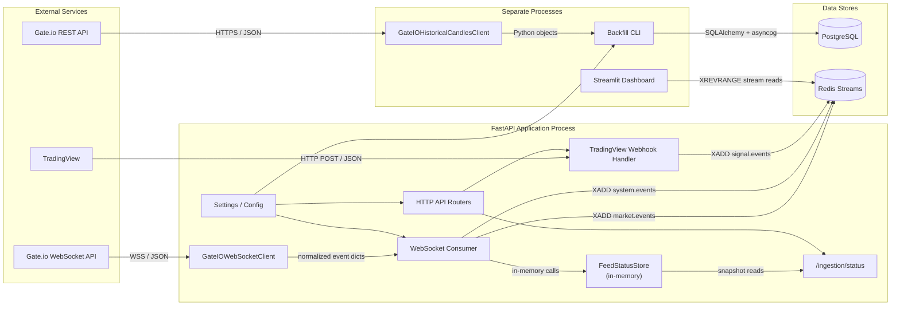
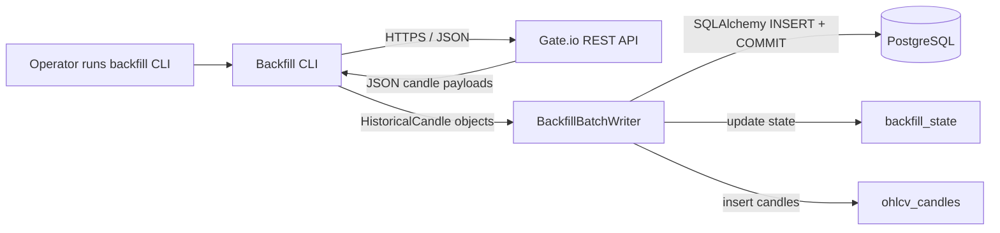
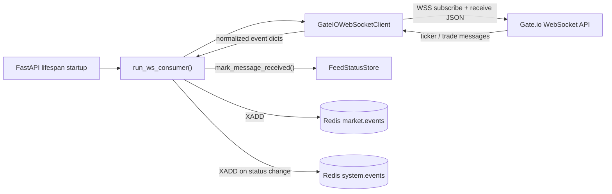
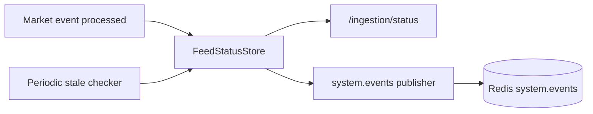
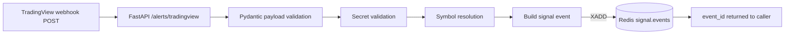
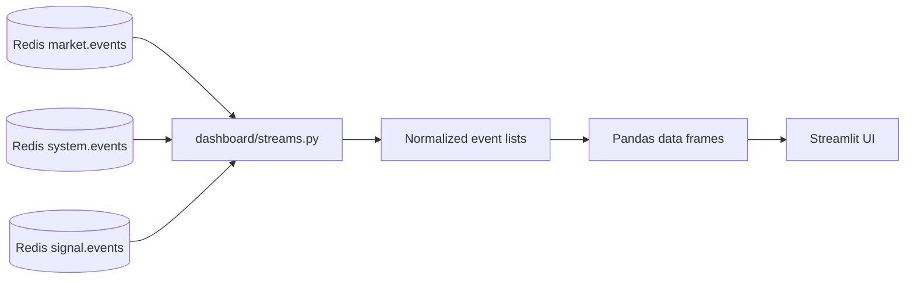

# Architecture Overview

> This document describes the current architecture of the codebase as it exists after sprint 2. It is a reference for development and handoff, not a sprint plan.
>
> Scope of this document:
> - only implemented components
> - only real runtime flows
> - no planned features unless they affect how the current system is structured

---

## 1. System Overview

The codebase currently implements a small market-ingestion system centered on
three runtime paths:

1. **Historical ingestion**
   - a manual backfill CLI fetches closed Gate.io candles and stores them in
     PostgreSQL

2. **Live market ingestion**
   - the FastAPI app starts a background WebSocket consumer that receives live
     Gate.io ticker and trade updates and publishes them to Redis Streams

3. **Signal ingestion**
   - a TradingView webhook endpoint validates incoming alerts and publishes them
     to Redis Streams

A separate **Streamlit dashboard** reads Redis Streams directly and renders
recent market, system, and signal events.

The system uses:
- **FastAPI** for HTTP endpoints
- **PostgreSQL** for durable historical candle and backfill state storage
- **Redis Streams** for live event transport
- **Gate.io REST** for historical candles
- **Gate.io WebSocket** for live ticker and trade updates

---

## 2. Runtime Boundaries

The system is split into distinct runtime units.

### FastAPI application process
Runs from `app/main.py`.

Responsibilities:
- serves HTTP endpoints
- loads application settings
- starts the live WebSocket consumer as a background task when `ws_enabled=true`
- exposes feed status via `/ingestion/status`
- accepts TradingView webhook alerts

### Backfill CLI process
Runs from `app/modules/ingestion/backfill.py`.

Responsibilities:
- fetches historical candles from Gate.io REST
- persists candles into PostgreSQL
- persists resumable backfill progress into PostgreSQL

This is **not** part of the running FastAPI app.

### Dashboard process
Runs from `app/dashboard/dashboard_app.py`.

Responsibilities:
- reads Redis Streams directly
- renders market, system, and signal information in Streamlit

This process is intentionally isolated from the FastAPI app.

### One-shot migration process
Runs Alembic migrations before the app starts in Docker Compose.

Responsibilities:
- applies schema migrations to PostgreSQL
- exits after migrations complete

---

## 3. Component Map

---

## 4. Main Components

| Component | Location | Responsibility |
|---|---|---|
| FastAPI app | `app/main.py` | Application startup, router registration, settings validation, background WebSocket consumer lifecycle |
| Health endpoint | `app/api/health.py` | Simple liveness endpoint |
| Ready endpoint | `app/api/ready.py` | Readiness endpoint, currently backed by a stubbed dependency check |
| Status endpoint | `app/api/status.py` | Returns current feed status snapshot from the in-memory store |
| TradingView webhook | `app/api/tradingview.py` | Validates alert payloads, checks secret, resolves symbol mapping, publishes to `signal.events` |
| Settings | `app/core/config.py` | Loads and caches environment-backed settings |
| Feed status store | `app/core/feed_status.py` | Process-local feed-health state used by live ingestion and the status endpoint |
| Gate.io REST client | `app/modules/ingestion/gateio_rest.py` | Fetches and normalizes historical candle data |
| Backfill pipeline | `app/modules/ingestion/backfill.py` | Manual backfill loop, batch persistence, resumable backfill state handling |
| Gate.io WebSocket client | `app/modules/ingestion/gateio_ws.py` | Connects to Gate.io live channels, normalizes ticker and trade events, reconnects with backoff |
| WebSocket consumer | `app/modules/ingestion/ws_consumer.py` | Receives normalized market events, updates feed status, publishes market and system events to Redis |
| Persistence models | `app/modules/persistence/models.py` | SQLAlchemy ORM models for candles and backfill state |
| Alembic migrations | `alembic/` | Database schema migration history and migration runtime |
| Dashboard stream helpers | `app/dashboard/streams.py` | Reads recent Redis stream events and normalizes stored values |
| Streamlit dashboard | `app/dashboard/dashboard_app.py` | Visualizes market, system, and signal data directly from Redis |

---

## 5. Data Flows

This section describes the real runtime flows in the current codebase, including
how data is transported and how it is transformed at each step.

---

### 5.1 Historical Candle Backfill

This flow is started manually from the CLI.

#### Entry point
- Command:
  - `python -m app.modules.ingestion.backfill`
- Main module:
  - `app/modules/ingestion/backfill.py`

#### Transport and formats
| Step                          | Transport                                                          | Format                                                                      |
| ----------------------------- | ------------------------------------------------------------------ | --------------------------------------------------------------------------- |
| CLI → Gate.io                 | HTTPS GET                                                          | Query parameters such as `currency_pair`, `interval`, `from`, `to`, `limit` |
| Gate.io → REST client         | HTTPS response body                                                | JSON array of candle payloads                                               |
| REST client → backfill writer | In-process Python call                                             | `HistoricalCandle` dataclass instances                                      |
| Backfill writer → PostgreSQL  | SQLAlchemy async session over `asyncpg` / PostgreSQL wire protocol | `INSERT` into `ohlcv_candles`, updates to `backfill_state`                  |

#### Flow details
1. The CLI validates settings and parses backfill arguments.
2. It creates an async SQLAlchemy engine and session factory.
3. It loads or creates a `BackfillState` row for `(instrument_id, timeframe)`.
4. It calls `GateIOHistoricalCandlesClient.get_candles(...)`.
5. The REST client:
   - sends an HTTPS request to Gate.io `/spot/candlesticks`
   - parses either list-based or mapping-based candle payloads
   - converts values into `HistoricalCandle`
   - filters out open candles
   - sorts candles by `open_time_utc`
6. `BackfillBatchWriter` converts candles into rows for `OHLCVCandle`.
7. Candle rows are inserted with:
   - `ON CONFLICT DO NOTHING`
   - uniqueness key:
     - `instrument_id`
     - `timeframe`
     - `open_time_utc`
8. The writer updates `BackfillState.last_completed_candle_open_time_utc` and
   commits the transaction.
9. The CLI sleeps for the configured delay and continues until the requested
   range is complete.

#### Persisted data
- `ohlcv_candles`
- `backfill_state`

#### Important architectural boundary
The backfill flow is **fully separate** from the live WebSocket ingestion path.
It does not publish to Redis Streams and does not run inside the FastAPI app.

---

### 5.2 Live Market Ingestion

This flow runs inside the FastAPI application process as a background task.

#### Entry point
- FastAPI lifespan in `app/main.py`
- Background task:
  - `run_ws_consumer()`

#### Transport and formats
| Step | Transport | Format |
|---|---|---|
| App → Gate.io | WSS | JSON subscribe messages for `spot.tickers` and `spot.trades` |
| Gate.io → WS client | WSS | JSON messages |
| WS client → consumer | In-process Python async iteration | normalized Python `dict` events |
| Consumer → Redis | Redis RESP over TCP using `redis.asyncio` | stream entries via `XADD` |

#### Event shape published to `market.events`
Normalized market events currently include:
- `event_type` = `ticker` or `trade`
- `instrument_id`
- `source_symbol`
- `source_time_utc`
- `ingested_at_utc`
- `payload`

Notes:
- `payload` is stored as a JSON string
- `source_time_utc` and `ingested_at_utc` are stored as ISO-8601 strings

#### Flow details
1. During FastAPI startup, `app/main.py` checks `settings.ws_enabled`.
2. If enabled, it creates a task for `run_ws_consumer()`.
3. `run_ws_consumer()`:
   - loads settings
   - creates a `GateIOWebSocketClient`
   - creates an async Redis client
   - configures the feed stale timeout
   - starts a background stale-checker task
4. `GateIOWebSocketClient.subscribe_market_data(...)`:
   - opens a WSS connection to Gate.io
   - subscribes to:
     - `spot.tickers`
     - `spot.trades`
   - parses incoming JSON messages
   - ignores non-update or unsupported messages
   - normalizes supported messages into internal event dicts
5. For each normalized event, `_process_market_event(...)`:
   - reads the previous feed status
   - updates the in-memory feed status via `mark_message_received()`
   - publishes the event to `market.events`
   - publishes a `feed_status` event to `system.events` when the feed transitions
     back to `live`
6. The stale checker periodically calls `feed_status_store.check_stale()`.
7. When the feed becomes stale, the consumer publishes a `feed_status` event to
   `system.events`.

#### Produced stream entries
- `market.events`
- `system.events`

#### Important architectural boundary
The WebSocket consumer is **not** a separate worker service. It runs inside the
same process as FastAPI and shares in-memory state with `/ingestion/status`.

---

### 5.3 Feed Status Tracking

Feed health is maintained inside the FastAPI process and exposed through both an
HTTP endpoint and Redis system events.

#### Main component
- `app/core/feed_status.py`

#### Data model
`FeedStatusStore` tracks:
- `status`
  - `live`
  - `stale`
  - `down`
- `last_message_at`
- `entries_blocked`

#### Transport and formats
| Step | Transport | Format |
|---|---|---|
| Consumer → FeedStatusStore | In-memory method calls | Python objects |
| Status endpoint → caller | HTTP / JSON | feed status snapshot |
| FeedStatusStore → Redis publisher | In-process Python call | status snapshot dict |
| Publisher → Redis | Redis RESP over TCP | `feed_status` stream entry |

#### Flow details
1. Live market events call `feed_status_store.mark_message_received()`.
2. This updates:
   - `last_message_at`
   - `status = live`
   - `entries_blocked = false`
3. A background stale checker periodically evaluates whether the last message is
   older than the configured timeout.
4. When stale, the store transitions to:
   - `status = stale`
   - `entries_blocked = true`
5. `GET /ingestion/status` returns the current snapshot by calling
   `feed_status_store.get_snapshot()`.
6. Status transitions that the consumer handles operationally are also
   published to `system.events`.

#### Returned status snapshot
The HTTP status endpoint currently returns:
- `status`
- `last_message_at_utc`
- `entries_blocked`

#### Important architectural boundary
This state is **process-local**. It is shared only within the FastAPI process
and is not persisted to PostgreSQL.

---

### 5.4 TradingView Signal Ingestion

This flow accepts webhook requests and publishes validated signals to Redis.

#### Entry point
- Route:
  - `POST /alerts/tradingview`
- Module:
  - `app/api/tradingview.py`

#### Transport and formats
| Step | Transport | Format |
|---|---|---|
| TradingView → FastAPI | HTTP POST | JSON request body |
| FastAPI internal validation | In-process Python call | `TradingViewWebhookPayload` Pydantic model |
| Handler → Redis | Redis RESP over TCP using `redis.asyncio` | stream entry via `XADD` |
| FastAPI → caller | HTTP / JSON | `{"status": "accepted", "event_id": ...}` |

#### Accepted request fields
Required:
- `secret`
- `symbol`
- `action`

Optional:
- `price`
- `timeframe`
- `message`
- `timestamp`

#### Flow details
1. FastAPI reads the request JSON body.
2. Pydantic validates the payload using `TradingViewWebhookPayload`.
3. The handler checks the shared secret against
   `settings.tradingview_webhook_secret`.
4. The incoming symbol is resolved to the configured internal instrument using:
   - `primary_instrument_id`
   - `primary_gateio_symbol`
   - `primary_tradingview_aliases`
5. A signal event dict is built with:
   - `event_type = tradingview_signal`
   - `instrument_id`
   - `source_symbol`
   - `action`
   - `received_at_utc`
   - `payload_hash`
   - optional request fields when present
6. The event is published to `signal.events` using `XADD`.
7. The endpoint returns `202 Accepted` with the Redis stream entry ID.

#### Produced stream entries
- `signal.events`

#### Important architectural boundary
The webhook does not write directly to PostgreSQL. Its integration point with
the rest of the system is Redis Streams.

---

### 5.5 Dashboard Read Path

The dashboard is a pure read-side component. It does not call the FastAPI app.

#### Entry point
- `app/dashboard/dashboard_app.py`

#### Transport and formats
| Step | Transport | Format |
|---|---|---|
| Dashboard → Redis | Redis RESP over TCP using `redis.Redis` | `XREVRANGE` reads |
| Stream helper → dashboard | In-process Python call | lists of normalized event dicts |
| Dashboard → browser | Streamlit server over HTTP | rendered UI |

#### Flow details
1. The dashboard loads dashboard-specific settings.
2. It creates a synchronous Redis client.
3. It pings Redis and reads:
   - `market.events`
   - `system.events`
   - `signal.events`
4. `read_recent_events(...)`:
   - reads stream entries in reverse order using `XREVRANGE`
   - reverses them back into chronological order
   - normalizes:
     - `payload` JSON strings into Python objects
     - `entries_blocked` string values into booleans
5. The dashboard:
   - renders recent market events
   - builds a price history frame from ticker/trade payloads
   - renders recent system events and feed status
   - renders recent signal events

#### Important architectural boundary
The dashboard reads Redis directly and stays decoupled from the FastAPI app.
This means:
- the app does not need to expose dashboard-specific endpoints
- the dashboard remains functional as long as Redis contains the needed events

---

## 6. State and Storage Boundaries

The current architecture uses three different storage categories.

### PostgreSQL: durable structured data
Used for:
- historical OHLCV candles
- backfill progress state

Tables:
- `ohlcv_candles`
- `backfill_state`

Characteristics:
- persistent
- relational
- used only by the backfill flow in the current codebase

---

### Redis Streams: transient event transport
Used for:
- live market events
- feed status events
- TradingView signal events

Streams:
- `market.events`
- `system.events`
- `signal.events`

Characteristics:
- append-only stream interface
- event-oriented rather than relational
- shared by the app and the dashboard

---

### In-memory process state
Used for:
- feed health tracking in `FeedStatusStore`

Characteristics:
- process-local
- not persisted
- shared inside the FastAPI process
- read by `/ingestion/status`
- updated by the WebSocket consumer

---

## 7. Database Model Summary

### `ohlcv_candles`
Purpose:
- stores closed OHLCV candles for one instrument and timeframe

Key fields:
- `instrument_id`
- `timeframe`
- `open_time_utc`
- `open_price`
- `high_price`
- `low_price`
- `close_price`
- `base_volume`
- `quote_volume`

Constraint:
- unique on:
  - `instrument_id`
  - `timeframe`
  - `open_time_utc`

---

### `backfill_state`
Purpose:
- stores resumable backfill progress per instrument/timeframe

Key fields:
- `instrument_id`
- `timeframe`
- `requested_start_utc`
- `requested_end_utc`
- `last_completed_candle_open_time_utc`
- `status`
- `last_error`

Constraint:
- unique on:
  - `instrument_id`
  - `timeframe`

Statuses:
- `pending`
- `running`
- `completed`
- `failed`

---

## 8. Redis Stream Summary

### `market.events`
Written by:
- `ws_consumer.py`

Carries:
- live `ticker` and `trade` events

Typical fields:
- `event_type`
- `instrument_id`
- `source_symbol`
- `source_time_utc`
- `ingested_at_utc`
- `payload`

---

### `system.events`
Written by:
- `ws_consumer.py`

Carries:
- feed health changes

Typical fields:
- `event_type = feed_status`
- `status`
- `entries_blocked`
- `updated_at_utc`
- `message`

---

### `signal.events`
Written by:
- `app/api/tradingview.py`

Carries:
- validated TradingView alerts

Typical fields:
- `event_type = tradingview_signal`
- `instrument_id`
- `source_symbol`
- `action`
- `received_at_utc`
- `payload_hash`

---

## 9. Infrastructure and Service Layout

In Docker Compose, the system is deployed as the following services:

| Service | Role |
|---|---|
| `postgres` | durable relational storage |
| `redis` | stream transport and dashboard read source |
| `migrate` | one-shot Alembic migration runner |
| `app` | FastAPI application plus background WebSocket consumer |
| `dashboard` | Streamlit UI reading Redis directly |

### Startup relationship
1. `postgres` and `redis` start first
2. `migrate` waits for `postgres` and applies migrations
3. `app` starts after:
   - `migrate` completes successfully
   - `postgres` is healthy
   - `redis` is healthy
4. `dashboard` starts after `redis` is healthy

### Process placement
- The WebSocket consumer lives **inside** the `app` service
- The dashboard is a **separate** service
- The backfill CLI is **not** started automatically by Docker Compose

---

## 10. Current Architectural Boundaries

These are current design boundaries visible in the implemented system.

### Backfill and live ingestion are separate paths
- historical data goes to PostgreSQL
- live market events go to Redis Streams
- no current component merges those two paths into one read model

### The dashboard is read-only and decoupled
- it reads Redis directly
- it does not call FastAPI endpoints
- it does not write to Redis or PostgreSQL

### Feed health is shared only inside the app process
- the WebSocket consumer updates it
- `/ingestion/status` reads it
- it is not a database-backed shared state

### Redis is the integration point for live and signal events
- live market data is published to `market.events`
- feed-health notifications are published to `system.events`
- TradingView signals are published to `signal.events`

### FastAPI is both HTTP server and live-ingestion host
- API handling and WebSocket consumption currently run in the same process
- there is no separate ingestion worker service

---

## 11. File-Level Entry Points

For quick reference, the main architectural entry points are:

| Purpose | Entry point |
|---|---|
| FastAPI app | `app/main.py` |
| Historical backfill CLI | `app/modules/ingestion/backfill.py` |
| Gate.io REST client | `app/modules/ingestion/gateio_rest.py` |
| Gate.io WebSocket client | `app/modules/ingestion/gateio_ws.py` |
| WebSocket consumer | `app/modules/ingestion/ws_consumer.py` |
| TradingView webhook | `app/api/tradingview.py` |
| Feed status store | `app/core/feed_status.py` |
| ORM models | `app/modules/persistence/models.py` |
| Dashboard | `app/dashboard/dashboard_app.py` |

---

## 12. Short Summary

The current system is a small multi-path ingestion architecture:

- **historical candles** are fetched from Gate.io REST and persisted to
  PostgreSQL by a standalone CLI
- **live ticker and trade events** are consumed from Gate.io WebSocket inside
  the FastAPI process and published to Redis Streams
- **TradingView alerts** are accepted over HTTP and published to Redis Streams
- **feed health** is tracked in memory inside the app process and exposed via
  both `/ingestion/status` and `system.events`
- the **dashboard** is a separate Streamlit process that reads Redis directly
