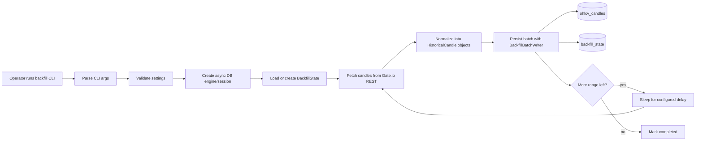
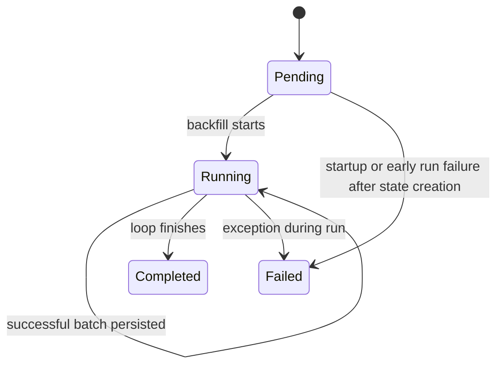

# Backfill Reference

> This document describes the current historical backfill implementation.
>
> Scope:
> - manual backfill CLI
> - batch persistence behavior
> - backfill state handling
> - database interaction
> - current runtime constraints

---

## 1. Overview

The backfill subsystem is responsible for fetching historical Gate.io candles
and storing them in PostgreSQL in an idempotent, resumable way.

Current behavior:
- runs as a manual CLI
- fetches historical spot candles from Gate.io REST
- stores closed candles in `ohlcv_candles`
- stores progress in `backfill_state`
- resumes from the last completed candle
- processes one instrument/timeframe state at a time

The backfill flow is separate from:
- FastAPI request handling
- live WebSocket ingestion
- Redis stream publication

---

## 2. Source Files

| Concern | File |
|---|---|
| Backfill CLI and batch writer | `app/modules/ingestion/backfill.py` |
| Historical candle client used by backfill | `app/modules/ingestion/gateio_rest.py` |
| Database models | `app/modules/persistence/models.py` |
| Backfill batch tests | `tests/test_backfill_batch.py` |
| Persistence model tests | `tests/test_persistence_models.py` |

---

## 3. Runtime Flow



---

## 4. Entry Points

### CLI entry point
- module: `app/modules/ingestion/backfill.py`
- function: `main(argv: Sequence[str] | None = None) -> int`

### Programmatic batch persistence entry point
- function: `persist_successful_backfill_batch(...)`

This is a convenience wrapper around:
- `BackfillBatchWriter.write_successful_batch(...)`

---

## 5. Current Scope

The current backfill implementation is intentionally narrow.

### Supported source
- Gate.io spot historical candles

### Supported timeframe
- `15m` only

### Supported instrument default
- `BTC_USDT`

### Output storage
- PostgreSQL only

### Current non-goals in implemented code
The backfill does not currently:
- run as a scheduled service
- expose an HTTP API
- publish to Redis Streams
- support concurrent coordinated workers
- support multiple timeframe configurations in the code

---

## 6. Main Constants

Defined in `backfill.py`:

| Constant | Value | Meaning |
|---|---|---|
| `DEFAULT_BACKFILL_BATCH_LIMIT` | `100` | default maximum candles requested per REST call |
| `DEFAULT_BACKFILL_INSTRUMENT_ID` | `BTC_USDT` | default instrument |
| `DEFAULT_BACKFILL_REQUEST_DELAY_SECONDS` | `3.0` | delay between requests |
| `DEFAULT_BACKFILL_TIMEFRAME` | `15m` | default timeframe |
| `BACKFILL_TIMEFRAME_SECONDS` | `{ "15m": 900 }` | supported timeframe-to-seconds map |

### Timeframe resolution
The function `_get_interval_seconds(timeframe)` uses
`BACKFILL_TIMEFRAME_SECONDS`.

Currently supported:
- `15m` → `900` seconds

---

## 7. CLI Arguments

The backfill command defines the following arguments.

| Argument | Type | Required | Meaning |
|---|---|---:|---|
| `--instrument-id` | string | no | internal instrument identifier / Gate.io pair |
| `--timeframe` | choice | no | timeframe to backfill |
| `--start-utc` | ISO-8601 datetime | yes on first run | requested start time |
| `--end-utc` | ISO-8601 datetime | no | requested end time |
| `--batch-limit` | positive int | no | candles requested per API call |
| `--request-delay-seconds` | non-negative float | no | delay between API calls |

### First-run rule
If no `BackfillState` row exists yet for `(instrument_id, timeframe)`,
`--start-utc` is required.

### End time default
If `--end-utc` is omitted, the code currently computes:

```python
datetime.now(UTC) - timedelta(seconds=interval_seconds)
```

This is used as the default requested end.

---

## 8. Main Types

### `BackfillSession`
A small protocol describing the DB session behavior required by the batch
writer.

Required methods:
- `add(...)`
- `execute(...)`
- `commit(...)`

This allows the batch-writing logic to depend on a small contract rather than a
specific concrete session class in tests.

---

### `BackfillBatchResult`
Summary returned after a successful batch write.

Fields:
- `candles_processed`
- `last_completed_candle_open_time_utc`

---

### `BackfillBatchWriter`
Responsible for:
- validating a candle batch
- building insert rows
- inserting candles
- advancing `BackfillState`
- committing the transaction

This is the core persistence component in the backfill flow.

---

## 9. Backfill State Model

The backfill process uses the `BackfillState` ORM model to track progress.

Relevant fields:
- `instrument_id`
- `timeframe`
- `requested_start_utc`
- `requested_end_utc`
- `last_completed_candle_open_time_utc`
- `status`
- `last_error`

### Status values
- `pending`
- `running`
- `completed`
- `failed`

### Uniqueness
There is one `BackfillState` row per:
- `instrument_id`
- `timeframe`

This is enforced by a database unique constraint.

---

## 10. State Lifecycle



### Meaning of transitions

#### `pending`
Newly created state before active processing begins.

#### `running`
Set when the run starts, and kept while successful batches continue.

#### `completed`
Set after the loop finishes successfully.

#### `failed`
Set when an exception occurs during the backfill run and the code is able to
persist the failure state.

---

## 11. Loading or Creating State

The helper `_load_or_create_backfill_state(...)` manages resumable state
initialization.

### If no state exists
The function:
1. requires `start_utc`
2. resolves `requested_end_utc`
3. validates `end > start`
4. creates a new `BackfillState`
5. commits it

### If state already exists
The function:
1. verifies the incoming `start_utc` matches the existing start if provided
2. verifies the incoming `end_utc` matches the existing end when both exist
3. fills `requested_end_utc` if the existing state has no end yet
4. returns the persisted state

### Why this matters
This prevents accidentally resuming a backfill with a different range than the
one already tracked in the database.

---

## 12. Cursor and Resume Behavior

The current resume cursor is computed by:

- `_next_backfill_cursor(state, interval_seconds)`

Behavior:
- if no candle has been completed yet:
  - start at `requested_start_utc`
- otherwise:
  - start at `last_completed_candle_open_time_utc + interval_seconds`

This means the runner resumes from the next expected candle boundary after the
last successfully persisted candle.

---

## 13. Batch Persistence Behavior

### Main method
- `BackfillBatchWriter.write_successful_batch(...)`

### Input
- DB session
- `BackfillState`
- sequence of `HistoricalCandle`

### Processing steps
1. sort candles by `open_time_utc`
2. reject an empty batch
3. reject any batch containing an explicitly open candle
4. convert candles into row dictionaries
5. insert rows into `ohlcv_candles`
6. use PostgreSQL `ON CONFLICT DO NOTHING`
7. update backfill state via `state.mark_successful_batch(...)`
8. add the updated state to the session
9. commit the session
10. return `BackfillBatchResult`

### Why insertion is idempotent
The insert statement targets the unique candle key:

- `instrument_id`
- `timeframe`
- `open_time_utc`

and uses:

- `on_conflict_do_nothing(...)`

So rerunning the same range does not create duplicate candle rows.

---

## 14. Batch Row Mapping

Each `HistoricalCandle` is mapped into an `OHLCVCandle` row shape:

| Output column | Source |
|---|---|
| `instrument_id` | `BackfillState.instrument_id` |
| `timeframe` | `BackfillState.timeframe` |
| `open_time_utc` | `HistoricalCandle.open_time_utc` |
| `open_price` | `HistoricalCandle.open_price` |
| `high_price` | `HistoricalCandle.high_price` |
| `low_price` | `HistoricalCandle.low_price` |
| `close_price` | `HistoricalCandle.close_price` |
| `base_volume` | `HistoricalCandle.base_volume` |
| `quote_volume` | `HistoricalCandle.quote_volume` |

Important detail:
- candle identity in the database comes from the backfill state context plus
  candle open time
- the incoming candle object itself does not carry instrument/timeframe fields

---

## 15. Main Run Loop

The core runtime function is:

- `_run_manual_backfill(args)`

### High-level steps
1. load validated settings
2. configure logging
3. create async engine and session factory
4. create `GateIOHistoricalCandlesClient`
5. load or create backfill state
6. mark state as `running`
7. repeatedly:
   - compute next cursor
   - stop if cursor is beyond requested end
   - fetch candles from Gate.io
   - stop if no more candles returned
   - persist successful batch
   - sleep before next request if more range remains
8. mark state as `completed`
9. dispose the DB engine

### Request execution
Historical REST calls are performed via:

```python
await asyncio.to_thread(client.get_candles, ...)
```

This keeps the blocking REST client off the async event loop thread.

---

## 16. Gate.io Request Parameters in Backfill

The backfill runner calls the historical client with:

- `currency_pair = state.instrument_id`
- `interval = state.timeframe`
- `limit = args.batch_limit`
- `from_timestamp = int(next_cursor_utc.timestamp())`
- `to_timestamp = int(requested_end_utc.timestamp())`

That means the runner always requests candles bounded by:
- current resume cursor
- requested end time

---

## 17. Error Handling

### In the batch writer
The writer raises `ValueError` for:
- empty candle batches
- batches containing open candles

### In the main run loop
If an exception occurs:
1. the code attempts `session.rollback()`
2. if a state object exists, it attempts to mark the state as:
   - `failed`
3. `last_error` is set to `str(exc)`
4. the exception is re-raised

### Engine cleanup
The DB engine is disposed in `finally`, so cleanup runs regardless of success or
failure.

---

## 18. CLI Exit Codes

The top-level `main()` function returns:

| Exit code | Meaning |
|---:|---|
| `0` | successful completion |
| `1` | unexpected failure |
| `2` | input/configuration `ValueError` |
| `130` | interrupted by `KeyboardInterrupt` |

This gives the CLI stable shell-level behavior.

---

## 19. Logging Behavior

The backfill module configures its own logging for CLI execution.

### Log content includes
- start/end of run
- instrument and timeframe
- range boundaries
- batch fetch operations
- processed candle counts
- sleep intervals between requests
- completion summary
- failure conditions

### Log format
The local CLI logger uses:

```text
%(asctime)s %(levelname)s %(name)s %(message)s
```

---

## 20. Database Interaction Summary

The backfill module uses:
- `select(...)` to load existing `BackfillState`
- PostgreSQL `insert(...)` for candle rows
- `commit()` after successful batch or state change

### Written tables
- `ohlcv_candles`
- `backfill_state`

### Important boundary
The backfill flow is the only currently implemented code path that writes to
PostgreSQL.

---

## 21. Tests Covering Backfill

### `tests/test_backfill_batch.py`
Covers:
- successful batch persistence updates state
- open candles are rejected

### `tests/test_persistence_models.py`
Covers:
- backfill state model shape
- successful batch state advancement helper

These tests focus primarily on persistence semantics, not full end-to-end
historical ingestion.

---

## 22. Current Operational Characteristics

The current implementation is designed to be conservative and resumable.

### Conservative request pattern
- explicit batch size
- explicit sleep between requests
- blocking HTTP moved to a worker thread
- single runner assumption

### Resumable state
Progress is persisted after successful batches, so interrupted runs can continue
from the saved watermark.

### Idempotent writes
Repeated ranges do not create duplicate candle rows because of the DB unique
constraint plus `ON CONFLICT DO NOTHING`.

---

## 23. Short Summary

The backfill subsystem is a standalone historical ingestion path.

- it fetches candles from Gate.io REST
- normalizes them into `HistoricalCandle`
- writes closed candles into `ohlcv_candles`
- tracks resumable progress in `backfill_state`
- commits progress batch by batch
- resumes from the last completed candle on later runs