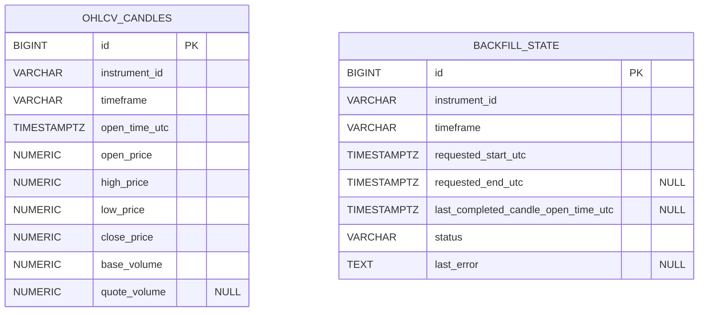
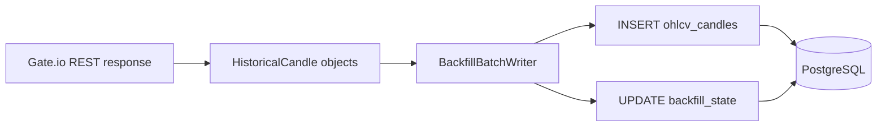

# Database Reference

> This document describes the current database layer implemented in the
> codebase.
>
> Scope:
> - PostgreSQL persistence currently used by the application
> - SQLAlchemy models and schema structure
> - Alembic migration setup
> - how the database is used by the current runtime flows

---

## 1. Overview

The current database layer is intentionally small.

PostgreSQL is used only for **durable historical ingestion state**:

1. **OHLCV candle storage**
   - closed historical candles fetched from Gate.io REST

2. **Backfill progress tracking**
   - resumable state for the manual historical backfill runner

The database is **not** currently used for:
- live market events
- feed status
- TradingView webhook events
- dashboard reads

Those paths use Redis Streams or in-memory state instead.

---

## 2. Technology Stack

| Layer | Implementation |
|---|---|
| Database | PostgreSQL |
| ORM | SQLAlchemy 2.x |
| Driver | `asyncpg` |
| Migrations | Alembic |
| Declarative base | `app/modules/persistence/base.py` |
| Models | `app/modules/persistence/models.py` |

### Async usage
The backfill pipeline uses SQLAlchemy async sessions and an async engine:

- `create_async_engine(...)`
- `async_sessionmaker(...)`
- `AsyncSession`

This database layer is currently used only by the backfill workflow.

---

## 3. Current Persistence Scope

### What is persisted
The current schema contains two tables:

- `ohlcv_candles`
- `backfill_state`

### What writes to PostgreSQL
The current writer is the manual backfill flow:

- `app/modules/ingestion/backfill.py`

### What does not write to PostgreSQL
The following runtime paths do not currently persist to the database:

- live Gate.io WebSocket ingestion
- feed status tracking
- TradingView webhook ingestion
- Streamlit dashboard

---

## 4. Schema Overview



### Relationship notes
There is **no foreign key** between `backfill_state` and `ohlcv_candles`.

The two tables are related **logically** by:
- `instrument_id`
- `timeframe`

That is sufficient for the current backfill workflow.

---

## 5. Declarative Base and Naming Convention

### Source
- `app/modules/persistence/base.py`

The project defines one SQLAlchemy declarative base:

- `Base`

It also configures a naming convention for constraints and indexes.

```python
NAMING_CONVENTION = {
    "ix": "ix_%(table_name)s_%(column_0_name)s",
    "uq": "uq_%(table_name)s_%(column_0_name)s_%(column_1_name)s",
    "ck": "ck_%(table_name)s_%(constraint_name)s",
    "fk": "fk_%(table_name)s_%(column_0_name)s_%(referred_table_name)s",
    "pk": "pk_%(table_name)s",
}
```

### Why this matters
This keeps generated constraint names stable and predictable across:
- ORM metadata
- Alembic migrations
- PostgreSQL schema

---

## 6. Table: `ohlcv_candles`

### Purpose
Stores closed OHLCV candles for one instrument and timeframe.

### ORM model
- `app.modules.persistence.models.OHLCVCandle`

### Migration
- `alembic/versions/202603250001_create_ingestion_tables.py`

### Columns

| Column | SQLAlchemy type | Null | Meaning |
|---|---|---:|---|
| `id` | `BigInteger`, `Identity()` | no | surrogate primary key |
| `instrument_id` | `String(64)` | no | internal instrument identifier, currently `BTC_USDT` |
| `timeframe` | `String(16)` | no | candle timeframe, currently `15m` in backfill |
| `open_time_utc` | `DateTime(timezone=True)` | no | candle open time in UTC |
| `open_price` | `Numeric(38, 18)` | no | open price |
| `high_price` | `Numeric(38, 18)` | no | high price |
| `low_price` | `Numeric(38, 18)` | no | low price |
| `close_price` | `Numeric(38, 18)` | no | close price |
| `base_volume` | `Numeric(38, 18)` | no | base asset volume |
| `quote_volume` | `Numeric(38, 18)` | yes | quote asset volume, if available |

### Constraints
Primary key:
- `pk_ohlcv_candles`

Unique constraint:
- `uq_ohlcv_candles_instrument_id_timeframe_open_time_utc`

Unique key columns:
- `instrument_id`
- `timeframe`
- `open_time_utc`

### Current write pattern
Rows are written by `BackfillBatchWriter` using PostgreSQL `INSERT ... ON CONFLICT DO NOTHING`.

This makes candle insertion **idempotent** for the unique key above.

### Current data policy
- only **closed candles** are persisted
- open candles are rejected before insert
- rows are written in chronological order after normalization

### Numeric precision
The model defines:

```python
NUMERIC_PRECISION = 38
NUMERIC_SCALE = 18
```

This precision is used for:
- prices
- base volume
- quote volume

This keeps numeric storage consistent and avoids storing market values as floats.

---

## 7. Table: `backfill_state`

### Purpose
Tracks resumable progress for the manual historical backfill runner.

### ORM model
- `app.modules.persistence.models.BackfillState`

### Migration
- `alembic/versions/202603250001_create_ingestion_tables.py`

### Columns

| Column | SQLAlchemy type | Null | Meaning |
|---|---|---:|---|
| `id` | `BigInteger`, `Identity()` | no | surrogate primary key |
| `instrument_id` | `String(64)` | no | internal instrument identifier |
| `timeframe` | `String(16)` | no | candle timeframe |
| `requested_start_utc` | `DateTime(timezone=True)` | no | requested start boundary for the backfill |
| `requested_end_utc` | `DateTime(timezone=True)` | yes | requested end boundary |
| `last_completed_candle_open_time_utc` | `DateTime(timezone=True)` | yes | latest successfully persisted candle open time |
| `status` | `Enum(BackfillStatus, native_enum=False)` | no | current backfill state |
| `last_error` | `Text` | yes | most recent error text when marked failed |

### Constraints
Primary key:
- `pk_backfill_state`

Unique constraint:
- `uq_backfill_state_instrument_id_timeframe`

Unique key columns:
- `instrument_id`
- `timeframe`

### Meaning of the unique constraint
The current model allows only **one backfill progress row** per:
- instrument
- timeframe

This matches the current backfill runner design.

### Status values
The `BackfillStatus` enum defines:

- `pending`
- `running`
- `completed`
- `failed`

The database column is stored as a **string-backed enum** because:
- `native_enum=False`
- `validate_strings=True`

The migration also sets a server default of:

```sql
'pending'
```

### Helper method
`BackfillState.mark_successful_batch(...)` performs the model-side state update
after a successful batch:

- updates `last_completed_candle_open_time_utc`
- sets `status = running`
- clears `last_error`

This method does not itself commit; persistence is done by the backfill writer.

---

## 8. How the Backfill Uses the Database

The database is currently used almost entirely by the manual backfill flow.



### Main write steps
1. Load or create the `BackfillState` row
2. Mark the state as `running`
3. Fetch a batch of historical candles from Gate.io
4. Insert normalized candle rows into `ohlcv_candles`
5. Advance `last_completed_candle_open_time_utc`
6. Commit the session
7. Repeat until the requested range is complete
8. Mark the state as `completed` or `failed`

### Transaction behavior
For a successful batch, candle insert and backfill state advancement happen in
the same session before commit.

That keeps:
- persisted candle rows
- persisted progress marker

aligned at the batch level.

---

## 9. Alembic Setup

### Files
- `alembic.ini`
- `alembic/env.py`
- `alembic/script.py.mako`
- `alembic/versions/202603250001_create_ingestion_tables.py`

### Metadata target
Alembic uses:

- `Base.metadata`

The env file imports the persistence models so metadata includes both tables.

### Database URL resolution
`alembic/env.py` loads env files using:

- `app.core.config._get_env_files()`

It then reads:

- `POSTGRES_DSN`

and sets it as Alembic's `sqlalchemy.url`.

### Online migrations
Alembic uses:

- `async_engine_from_config(...)`

with:
- `pool.NullPool`

### Initial migration
The current repository contains one schema migration:

- `202603250001_create_ingestion_tables.py`

It creates:
- `ohlcv_candles`
- `backfill_state`

---

## 10. Docker Migration Flow

In Docker, migrations are run by a dedicated service:

- `migrate`

### Compose behavior
- `postgres` starts first
- `migrate` waits for `postgres` health
- `migrate` runs `alembic upgrade head`
- `app` waits for `migrate` to complete successfully

### Migration image
The Dockerfile contains a `migrate` target that:
- installs Alembic
- copies `alembic.ini`
- copies the `alembic/` directory
- runs the migration command as the container entrypoint

This keeps schema application separate from the application startup logic.

---

## 11. Source Files

| Concern | File |
|---|---|
| Declarative base | `app/modules/persistence/base.py` |
| ORM models | `app/modules/persistence/models.py` |
| Persistence exports | `app/modules/persistence/__init__.py` |
| Alembic environment | `alembic/env.py` |
| Initial migration | `alembic/versions/202603250001_create_ingestion_tables.py` |
| Backfill writer and CLI | `app/modules/ingestion/backfill.py` |

---

## 12. Current Implementation Notes

### PostgreSQL is not in the live ingestion path
The live WebSocket consumer publishes to Redis and updates in-memory feed state.
It does not currently persist live events to PostgreSQL.

### TradingView webhook events are not stored in PostgreSQL
TradingView alerts are published to Redis `signal.events`, not inserted into
database tables.

### There is no HTTP read API for persisted candles
The current FastAPI app does not expose endpoints for:
- querying `ohlcv_candles`
- querying `backfill_state`

Database reads are currently internal to the backfill flow.

### Database schema is intentionally narrow
The current schema is focused on one implemented use case:
- historical candle persistence with resumable backfill tracking

It does not currently model:
- orders
- positions
- executions
- strategy state
- webhook audit history
- live tick archival

---

## 13. Short Summary

The current database layer is a focused persistence subsystem for historical ingestion.

- `ohlcv_candles` stores closed historical OHLCV candles
- `backfill_state` stores resumable backfill progress
- SQLAlchemy and Alembic manage the schema and model layer
- PostgreSQL is used only by the backfill flow in the current codebase
- live ingestion, feed status, and TradingView signals are handled elsewhere