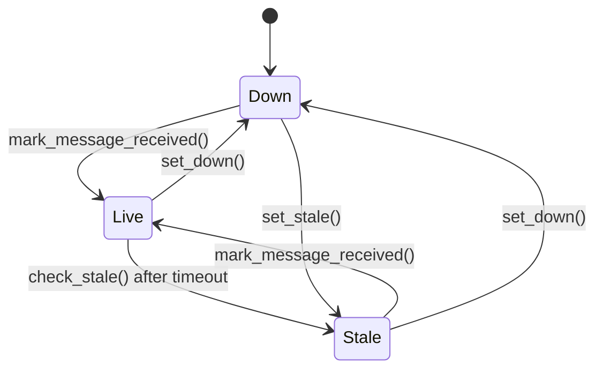

# Feed Status Reference

> This document describes the current feed-status implementation used by the
> live ingestion flow.
>
> Scope:
> - in-process feed status state
> - state transitions
> - interaction with live market ingestion
> - interaction with `/ingestion/status`
> - current behavior as implemented in code

---

## 1. Overview

Feed status is tracked in-memory by `FeedStatusStore`.

It is used for two things:

1. **operational visibility**
   - exposed through `GET /ingestion/status`

2. **runtime gating signal**
   - `entries_blocked` indicates whether new entries should be blocked based on
     current feed health

The store is updated by the live WebSocket consumer and read by the API status
endpoint.

---

## 2. Source Files

| Concern | File |
|---|---|
| Feed status store | `app/core/feed_status.py` |
| Status endpoint | `app/api/status.py` |
| Live ingestion integration | `app/modules/ingestion/ws_consumer.py` |
| Tests | `tests/test_status.py`, `tests/test_ws_consumer.py` |

---

## 3. Main Types

### `FeedStatus`
Enum of allowed feed states.

Values:
- `live`
- `stale`
- `down`

### `FeedStatusState`
Dataclass holding the current in-memory state.

Fields:
- `status`
- `last_message_at`
- `entries_blocked`
- `_status_change_callbacks`

### `FeedStatusStore`
Thread-safe wrapper around `FeedStatusState`.

Responsibilities:
- track the current feed state
- update state when market data arrives
- evaluate stale conditions
- expose a serializable snapshot for API responses
- hold a configurable stale timeout value

### `feed_status_store`
Module-level singleton instance used by the current runtime code.

Canonical import:

```python
from app.core.feed_status import feed_status_store
```

---

## 4. State Model

### Stored fields

| Field | Type | Meaning |
|---|---|---|
| `status` | `FeedStatus` | current feed state |
| `last_message_at` | `datetime \| None` | time of the most recent accepted market message |
| `entries_blocked` | `bool` | whether new entries should be blocked |
| `_status_change_callbacks` | list | registered callbacks invoked on state changes |

### Default state
When the process starts, the default state is:

```text
status = down
last_message_at = None
entries_blocked = true
```

### Stale timeout
The store also tracks an internal stale timeout:

- default: `60.0` seconds

This value is configured at runtime by the WebSocket consumer using:

```python
feed_status_store.set_stale_timeout(settings.feed_stale_timeout_seconds)
```

---

## 5. State Transitions



### Transition meaning

#### `down -> live`
Happens when a market message is processed and the consumer calls:

- `mark_message_received()`

#### `live -> stale`
Happens when:
- the stale checker runs
- the elapsed time since `last_message_at` exceeds the configured timeout

#### `live/stale -> down`
Happens when code explicitly calls:

- `set_down()`

#### `down -> stale`
Only happens if code explicitly calls:

- `set_stale()`

This is different from `check_stale()`. See implementation notes below.

---

## 6. Public Store Methods

### `get_snapshot() -> dict`
Returns a JSON-serializable dictionary:

```json
{
  "status": "live",
  "last_message_at_utc": "2026-03-29T12:00:00+00:00",
  "entries_blocked": false
}
```

Fields returned:
- `status`
- `last_message_at_utc`
- `entries_blocked`

This is the value returned directly by the status API endpoint.

---

### `mark_message_received() -> None`
Called when a valid live market event is received.

Effects:
- sets `last_message_at` to current UTC time
- sets `status = live`
- sets `entries_blocked = false`
- invokes status-change callbacks if the previous status was not `live`

This is the main path by which the feed recovers to live state.

---

### `check_stale() -> bool`
Evaluates whether the feed should currently be considered stale.

Current behavior:
- if `last_message_at is None`, returns `True`
- otherwise compares elapsed time against the configured stale timeout
- if elapsed time exceeds the timeout:
  - sets `status = stale` if not already stale
  - sets `entries_blocked = true`
  - invokes status-change callbacks on transition
  - returns `True`
- otherwise returns `False`

This method both:
- checks state
- and may mutate state

It is used by the background stale checker in `ws_consumer.py`.

---

### `set_stale() -> None`
Forces the store into stale state.

Effects:
- sets `status = stale`
- sets `entries_blocked = true`
- invokes status-change callbacks if the previous status was not stale

This method does not modify `last_message_at`.

---

### `set_down() -> None`
Forces the store into down state.

Effects:
- sets `status = down`
- sets `entries_blocked = true`
- invokes status-change callbacks if the previous status was not down

This method does not modify `last_message_at`.

---

### `set_status(status: FeedStatus) -> None`
Small convenience method.

Behavior:
- `FeedStatus.LIVE` → `mark_message_received()`
- `FeedStatus.STALE` → `set_stale()`
- any other value currently resolves to `set_down()`

With the current enum, this means:
- `FeedStatus.DOWN` → `set_down()`

---

### `set_stale_timeout(timeout_seconds: float) -> None`
Updates the internal stale timeout threshold.

### `get_stale_timeout() -> float`
Returns the current stale timeout threshold.

---

### `register_status_change_callback(callback) -> None`
Registers a callback to be invoked when the status changes.

Current behavior:
- callbacks are stored in `_status_change_callbacks`
- callback exceptions are swallowed
- no current runtime code registers callbacks

This method exists as an extension point.

---

## 7. Runtime Integration

## 7.1 Status API

### Route
- `GET /ingestion/status`

### Source
- `app/api/status.py`

The route simply returns:

```python
feed_status_store.get_snapshot()
```

This means the API response is a direct view of in-memory state inside the
FastAPI process.

---

## 7.2 WebSocket Consumer

### Source
- `app/modules/ingestion/ws_consumer.py`

The WebSocket consumer is the main writer of feed status.

It integrates with the store in three places:

#### 1. Configure stale timeout at startup
```python
feed_status_store.set_stale_timeout(settings.feed_stale_timeout_seconds)
```

#### 2. Mark feed live when market data arrives
`_process_market_event(...)` does:

- read previous status
- call `feed_status_store.mark_message_received()`
- publish the market event to Redis
- publish a `feed_status` system event if the previous status was not `live`

#### 3. Periodic stale checks
`_run_stale_checker(...)` periodically calls:

```python
is_stale = feed_status_store.check_stale()
```

If `is_stale` is true, it publishes a `feed_status` event to Redis
`system.events`.

---

## 8. Feed Status and Redis System Events

The store itself does not write to Redis.

Redis publication is handled by the WebSocket consumer via:

- `_publish_feed_status_event(...)`

### Published event shape
Current system events contain:

| Field | Type | Meaning |
|---|---|---|
| `event_type` | string | always `feed_status` |
| `status` | string | snapshot status value |
| `entries_blocked` | string | boolean stored as string |
| `updated_at_utc` | string | publication timestamp |
| `message` | string | human-readable status message |

### Example
```json
{
  "event_type": "feed_status",
  "status": "stale",
  "entries_blocked": "True",
  "updated_at_utc": "2026-03-29T12:00:10+00:00",
  "message": "Feed marked stale - no ticker message within timeout"
}
```

---

## 9. Locking and Thread Safety

`FeedStatusStore` uses a `threading.Lock` to protect access to internal state.

Protected operations include:
- reading snapshots
- mutating status
- mutating stale timeout
- registering callbacks

### Why this exists
The store is process-local shared state used by multiple code paths in the app
process, so internal mutation is serialized through the lock.

---

## 10. Current Implementation Notes

### The store is process-local
The feed state exists only in memory inside the current Python process.

It is:
- not persisted to PostgreSQL
- not stored in Redis as the source of truth
- not shared across multiple app processes automatically

Redis `system.events` provides an event stream, but not a canonical shared state
object.

---

### `check_stale()` has a special case when no message has ever been seen
If `last_message_at` is `None`, `check_stale()` returns `True` immediately.

Important detail:
- this does **not** change the store status from `down` to `stale`

So, before any live message is received:
- the store remains `down`
- `check_stale()` still reports a stale condition to the caller

This matters because the stale checker may publish a system event while the
snapshot status remains `down`.

---

### Stale publication is driven by the return value of `check_stale()`
In `ws_consumer.py`, the stale checker publishes a system event whenever:

```python
check_stale() == True
```

Because `check_stale()` returns `True` for an already stale feed as well,
the current stale checker behavior can continue publishing stale status events
on later checks until live data resumes.

This is the current runtime behavior and should be kept in mind when changing
status publishing semantics.

---

### Market events currently drive liveness recovery
`_process_market_event(...)` marks the feed as live for every processed market
event.

That means the current implementation treats **any accepted market event**
as evidence that the feed is live.

In practice, this currently includes:
- ticker events
- trade events

---

### `entries_blocked` is derived from feed state
Current behavior is:

- `live` → `entries_blocked = false`
- `stale` → `entries_blocked = true`
- `down` → `entries_blocked = true`

This value is carried both:
- in the in-memory snapshot
- in published `system.events`

---

### Status-change callbacks are available but not wired into runtime behavior
The store supports status-change callbacks, but no current code registers any.

This means:
- callbacks are an extension point
- they are not part of the active runtime path today

---

## 11. Tests Covering Feed Status

### `tests/test_status.py`
Covers:
- `GET /ingestion/status`
- snapshot values from the global store

### `tests/test_ws_consumer.py`
Covers:
- stale checker publishing when the feed becomes stale
- no stale publication while the feed is live
- recovery to live publication
- no duplicate live publication when already live
- stale timeout configuration
- Redis error handling in stale checks

These tests are the best source for current expected behavior at the integration
level.

---

## 12. Short Summary

The feed-status subsystem is a small in-memory state holder shared inside the
FastAPI process.

- `FeedStatusStore` is the source of current feed state
- `ws_consumer.py` updates it from live market ingestion
- `/ingestion/status` exposes its snapshot over HTTP
- `system.events` mirrors status changes as Redis stream events
- the implementation is intentionally lightweight and process-local