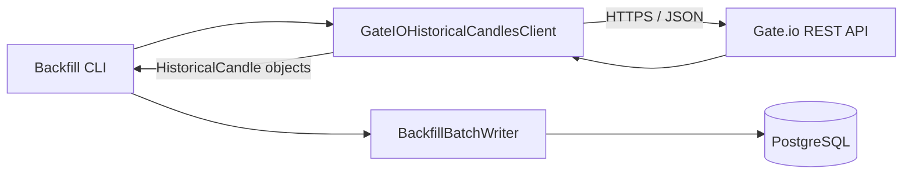
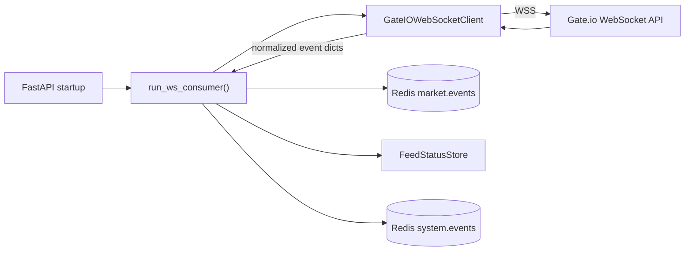

# Gate.io Client Reference

> This document describes the current Gate.io integration code in the
> repository.
>
> Scope:
> - historical REST client
> - live WebSocket client
> - normalized data produced by each client
> - current behavior only

---

## 1. Overview

The codebase currently integrates with Gate.io through two separate client
modules:

1. **Historical REST client**
   - fetches historical candlestick data
   - normalizes candle payloads into internal Python objects

2. **Live WebSocket client**
   - subscribes to live ticker and trade channels
   - normalizes incoming messages into internal event dictionaries

These clients are intentionally narrow:
- REST is used for **historical candles**
- WebSocket is used for **live ticker and trade events**

They are transport-layer clients only. Higher-level behavior such as persistence,
feed-status updates, and Redis publication is handled elsewhere.

---

## 2. Source Files

| Concern | File |
|---|---|
| Historical REST client | `app/modules/ingestion/gateio_rest.py` |
| Live WebSocket client | `app/modules/ingestion/gateio_ws.py` |
| Live consumer using the WS client | `app/modules/ingestion/ws_consumer.py` |
| REST client tests | `tests/test_gateio_rest_client.py` |
| WebSocket client tests | `tests/test_gateio_ws.py` |

---

## 3. Responsibilities and Boundaries

### What the Gate.io clients do
- connect to Gate.io over the relevant transport
- validate basic inputs
- parse Gate.io payloads
- normalize data into internal shapes
- handle transport/parsing errors at the client layer

### What the Gate.io clients do not do
- write to PostgreSQL
- publish to Redis Streams
- manage FastAPI lifecycle
- manage long-lived application state
- own feed-status logic

Those responsibilities belong to:
- `backfill.py`
- `ws_consumer.py`
- `feed_status.py`

---

## 4. Historical REST Client

### Module
- `app/modules/ingestion/gateio_rest.py`

### Main class
- `GateIOHistoricalCandlesClient`

### Purpose
Fetch historical Gate.io spot candlestick data and normalize it into internal
`HistoricalCandle` objects.

### Default configuration

| Setting | Value |
|---|---|
| Base URL | `https://api.gateio.ws/api/v4` |
| Timeout | `10.0` seconds |
| Default user agent | `ai-bot/1.0` |

### Public method

```python
get_candles(
    currency_pair: str,
    interval: str = "15m",
    *,
    limit: int | None = None,
    from_timestamp: int | None = None,
    to_timestamp: int | None = None,
) -> list[HistoricalCandle]
```

### Input validation
The method validates:

- `currency_pair` must not be empty
- `interval` must not be empty
- `limit`, if provided, must be greater than zero
- if both timestamps are provided:
  - `from_timestamp <= to_timestamp`

### Gate.io endpoint used
The client issues an HTTP GET request to:

- `/spot/candlesticks`

Query parameters are built from:
- `currency_pair`
- `interval`
- `limit`
- `from`
- `to`

### Request transport
- **Transport:** HTTPS
- **Library:** `urllib.request`
- **Request type:** GET
- **Headers:**
  - `Accept: application/json`
  - `User-Agent: ...`

---

## 5. Historical Candle Output Model

### Dataclass
- `HistoricalCandle`

### Fields

| Field | Type | Meaning |
|---|---|---|
| `open_time_utc` | `datetime` | candle open timestamp in UTC |
| `open_price` | `Decimal` | open price |
| `high_price` | `Decimal` | high price |
| `low_price` | `Decimal` | low price |
| `close_price` | `Decimal` | close price |
| `base_volume` | `Decimal` | base asset volume |
| `quote_volume` | `Decimal \| None` | quote asset volume, when present |
| `is_closed` | `bool \| None` | closed/open status when the payload provides it |

### Why this model exists
It gives the rest of the system a normalized, strongly typed representation of
historical candle data without exposing Gate.io payload shape directly.

---

## 6. Historical Candle Parsing

The client supports **two Gate.io payload formats**.

### 6.1 Mapping / object payloads

Example shape:
```json
{
  "t": "1700000000",
  "v": "12.5",
  "c": "101.0",
  "h": "102.0",
  "l": "99.5",
  "o": "100.0",
  "sum": "1262.5",
  "is_closed": "true"
}
```

Required fields:
- `t`
- `v`
- `c`
- `h`
- `l`
- `o`

Optional fields:
- `sum`
- `is_closed`
- `closed`

Mapping fields are normalized into `HistoricalCandle`.

---

### 6.2 Sequence / array payloads

Example shape:
```json
["1700000000", "7.5", "100.0", "101.0", "99.0", "98.0"]
```

Current positional interpretation:

| Position | Meaning |
|---:|---|
| `0` | timestamp |
| `1` | base volume |
| `2` | close price |
| `3` | high price |
| `4` | low price |
| `5` | open price |

Extra values may be interpreted as:
- `quote_volume`
- `is_closed`

depending on position and content.

---

### 6.3 Normalization rules

#### Timestamp parsing
- timestamps are converted to UTC `datetime`
- parsing uses integer epoch seconds

#### Decimal parsing
The following are parsed as `Decimal`:
- prices
- volumes

This avoids float-based precision loss.

#### Boolean parsing
Optional closed flags are accepted when represented as:
- `true`
- `false`
- `1`
- `0`
- Python booleans

#### Open candle filtering
After parsing, the client removes candles where:

```python
candle.is_closed is False
```

That means:
- explicitly open candles are removed
- candles with `is_closed=None` are kept

---

## 7. Historical REST Client Return Behavior

### Return value
The client returns:

- a list of `HistoricalCandle`
- sorted by `open_time_utc` ascending

### Sorting
Even if Gate.io returns candles out of order, the client sorts them before
returning.

### Empty results
If Gate.io returns an empty JSON array, the client returns an empty list.

---

## 8. Historical REST Client Exceptions

### Base exception
- `GateIOClientError`

### Request-level exception
- `GateIORequestError`

Raised for transport/request failures such as:
- HTTP error status
- URL/network errors
- non-200 HTTP responses

### Response-level exception
- `GateIOResponseError`

Raised when a response cannot be parsed or normalized, for example:
- non-JSON body
- unexpected payload shape
- missing candle fields
- invalid decimal values
- invalid timestamps
- invalid boolean values

### Purpose of the exception split
This keeps:
- transport problems
- payload/format problems

separate at the call site.

---

## 9. Current Runtime Use of the REST Client

The historical client is currently used by:

- `app/modules/ingestion/backfill.py`

The flow is:



The REST client itself does not know anything about:
- `BackfillState`
- SQLAlchemy
- PostgreSQL schema

That separation is intentional.

---

## 10. Live WebSocket Client

### Module
- `app/modules/ingestion/gateio_ws.py`

### Main class
- `GateIOWebSocketClient`

### Purpose
Connect to Gate.io over WebSocket, subscribe to ticker and trade channels, and
yield normalized event dictionaries.

### Default configuration

| Setting | Value |
|---|---|
| Base URL | `wss://api.gateio.ws/ws/v4/` |
| Initial reconnect delay | `5.0` seconds |
| Maximum reconnect delay | `60.0` seconds |
| Default user agent | `ai-bot/1.0` |

### Public method

```python
async def subscribe_market_data(
    currency_pair: str,
) -> AsyncGenerator[dict[str, Any], None]
```

### Input validation
- `currency_pair` must not be empty

### Current supported channels
The client subscribes to:

- `spot.tickers`
- `spot.trades`

These subscriptions are sent immediately after connection is established.

---

## 11. WebSocket Transport Behavior

### Transport
- **Transport:** WSS
- **Library:** `websockets`

### Connection behavior
The client keeps running in a `while True` loop:
- connect
- subscribe
- read messages
- reconnect on disconnect or error

### Header compatibility
The code checks the installed `websockets.connect` signature and uses either:
- `additional_headers`
- or `extra_headers`

This keeps the client compatible with different `websockets` versions.

---

## 12. WebSocket Message Handling

### Supported incoming message shape
The parser currently handles only message objects where:

- the top-level payload is a `dict`
- `event == "update"`
- `result` is a `dict`

Other messages are ignored.

### Supported channels
- `spot.tickers`
- `spot.trades`

Unknown channels are ignored.

### Message parsing entry point
- `_parse_ws_message(data, currency_pair)`

This returns either:
- a normalized event dictionary
- or `None` if the message is not relevant

---

## 13. Normalized WebSocket Event Shape

Both ticker and trade messages are normalized into a common outer structure.

### Common fields

| Field | Type | Meaning |
|---|---|---|
| `event_type` | string | `ticker` or `trade` |
| `instrument_id` | string | internal instrument identifier, currently the requested `currency_pair` |
| `source_symbol` | string | source symbol from Gate.io payload if present |
| `source_time_utc` | string | ISO-8601 timestamp derived from the source payload |
| `ingested_at_utc` | string | ISO-8601 UTC timestamp generated by the client |
| `payload` | string | raw message payload serialized as JSON |

### Ticker event example
```json
{
  "event_type": "ticker",
  "instrument_id": "BTC_USDT",
  "source_symbol": "BTC_USDT",
  "source_time_utc": "2023-11-14T22:13:20+00:00",
  "ingested_at_utc": "2026-03-29T12:00:00+00:00",
  "payload": "{\"currency_pair\": \"BTC_USDT\", \"t\": 1700000000, \"last\": \"50000.00\"}"
}
```

### Trade event example
```json
{
  "event_type": "trade",
  "instrument_id": "BTC_USDT",
  "source_symbol": "BTC_USDT",
  "source_time_utc": "2023-11-14T22:13:20+00:00",
  "ingested_at_utc": "2026-03-29T12:00:00+00:00",
  "payload": "{\"currency_pair\": \"BTC_USDT\", \"t\": 1700000000, \"id\": 12345, \"price\": \"50000.00\"}"
}
```

---

## 14. Timestamp Handling in the WebSocket Client

Source timestamps are read from:

- `payload["t"]`

They are converted to an ISO-8601 UTC string.

If parsing fails, the client currently falls back to:

- `datetime.now(UTC).isoformat()`

This means the event still gets emitted even when the source timestamp is not
usable.

---

## 15. Reconnect Behavior

The WebSocket client reconnects automatically when the connection is lost or an
unexpected runtime error occurs.

### Reconnect strategy
- start with `reconnect_delay`
- after each reconnect-worthy failure:
  - sleep for current delay
  - double the delay
  - cap at `max_reconnect_delay`

### Delay reset
When a valid supported message is successfully parsed, the reconnect delay is
reset to the initial value.

### Current exceptions handled for reconnect
- `ConnectionClosed`
- `InvalidStatus`
- general exceptions

### Important boundary
Reconnect behavior belongs to the client itself.
Feed-status changes on stale/down/live are handled outside the client by
`ws_consumer.py`.

---

## 16. Current Runtime Use of the WebSocket Client

The WebSocket client is currently used by:

- `app/modules/ingestion/ws_consumer.py`

Flow:



The WebSocket client itself does not:
- publish to Redis
- update feed status
- manage FastAPI lifecycle

It only yields normalized events.

---

## 17. Tests Covering Gate.io Clients

### REST client tests
- `tests/test_gateio_rest_client.py`

Covers:
- request construction
- query parameter generation
- parsing list payloads
- parsing mapping payloads
- filtering open candles
- rejecting invalid response shapes

### WebSocket client tests
- `tests/test_gateio_ws.py`

Covers:
- ticker event parsing
- trade event parsing
- skipping non-update messages
- skipping unknown channels

---

## 18. Short Summary

The Gate.io integration layer is split into two focused client modules.

- `gateio_rest.py`
  - fetches historical candles over HTTPS
  - returns typed `HistoricalCandle` objects

- `gateio_ws.py`
  - subscribes to live ticker and trade channels over WebSocket
  - yields normalized event dictionaries with reconnect support

These modules provide exchange-specific transport and normalization logic, while
higher-level application behavior is handled elsewhere.
